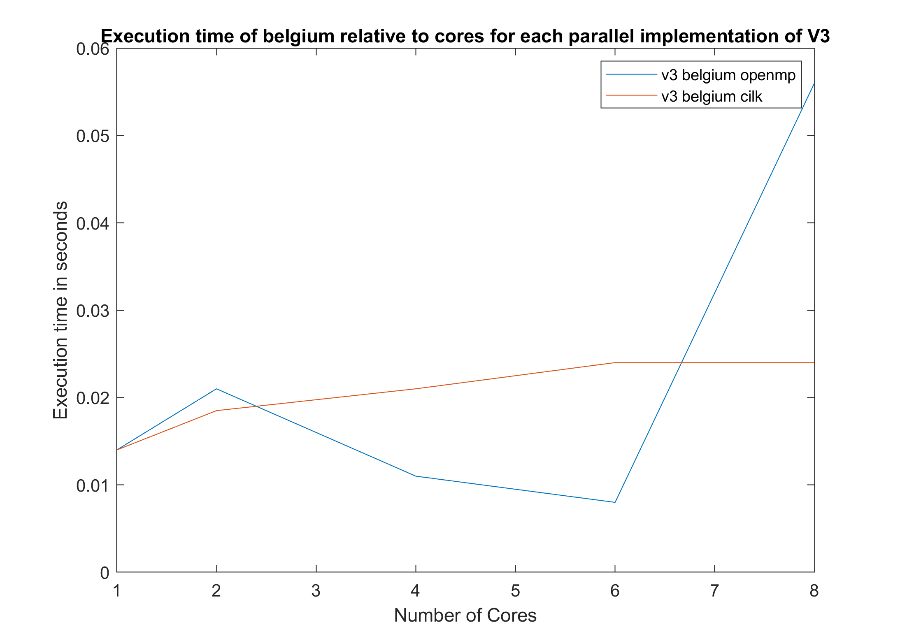

# Parallel and Distributed Systems

The code for v1 is triangle.c

The code for v2 is triangle_v2.c

The code for v3 are as follows:
- triangle_v3.c (serial)
- triangle_v3_cilk.c (parallelization with cilk)
- triangle_v3_openmp.c (parallelization with openmp)

The code for v4 are as follows:
- triangle_v4.c (serial)
- triangle_v4_cilk.c (parallelization with cilk)
- triangle_v4_openmp.c (parallelization with openmp)

The matrices folder contains the tables in COO format

Inside the Matlab folder, there is code for implementing v4 in Matlab.

Using the `make all` command, you can compile the necessary files in c.

For execution:

`[executable name] [mtx file name] [1 or 0(1 for binary mtx, else 0) [number of cores in multicore codes]`

Example execution: 

`./triangle_v3 ./matrixes/belgium_osm/belgium_osm.mtx 1`

`./triangle_v3_cilk ./matrixes/belgium_osm/belgium_osm.mtx 1 2`

Alternatively you can use `autorun.sh` which executes every code for every array with default number of processors equal to 2.

---

## Assignment Report

# Parallel and Distributed Systems
# Marios Pakas
# 9498

## Exercise 1

### Data structure analysis
The first step of developing the code was reading the Market Matrix files. In order to help the user input their own binary matrices for testing, I developed an option through the command line terminal to input 0 for a non-binary matrix and 1 for a binary matrix (default is 1). This way the algorithm can discern if a COO matrix has 3 or 2 elements per row in order to read the matrix without getting out of the matrix bounds. This solution does not work with matrices with no 0 elements in the diagonal. 

Also, it was important for version 3 of the project to have the matrices in an upper-triangular format, so as to compare the column and the row of the symmetric matrix. Depending on which value was bigger, I used it accordingly to input the matrix to the function coo2csc and have an upper-triangular matrix transformed from COO to CSC format. In the version 4 of the project I preffered to work with the whole matrix and only the symmetric one, so I mirrored the elements in order to make my algorithm work faster and more efficiently.

### Version 3 algorithm analysis:
Since we have the matric in CSC format (explained above) the idea was the following: I start from a random element of the matrix and assume that element is the (row1, col1). I then know that:
(row1,col1) -> (col1,col2) -> (col2,row1): Those elements need to exist in those indexes in order for a triangle to exist in the matrix.
In the CSC format, the easiest way to search was to search each for a non-zero row, based on the index of the columns (incrementing the column index, meant going to the next row, and then I could deduct whether that row contains only 0s or not). Subsequently (and because the matrix was symmetric, hence column = row and vice versa), I could search for the column with the index row1 (as explained above, an element with column row1 is necessary to complete the triangle) and find the values that existed as rows now. This way I could find (potentially, if it exists) the element in the index (col2, row1). In order to complete my search the only piece missing now is the element (col1, col2), which meant that I needed to search if column col2 contains any elements with index col1. If such an element existed then I could increment the triangle counter variable and store the edges row, col1, col2 in the c3 array.

### Ανάλυση αλγορίθμου V4
For this version of the algorithm the first step was to implement the following multiplication `C=A⊙(A*A)`. At first, I performed every multiplication on a separate step but then I changed my implementation because the result was a dense array, which was memory intensive and was not worth the tradeoff. The idea behind this multiplication is that the only common elements that will exist in the end will be at the exact same place as the original A matrix. That meant I could start by sweeping through every element (row1, col1) and in the next step calculate the value (A\*A)[row1,col1]. This value is equal to the sum of the multiplication between the values of row row1 and column col1. I take advantage of the symmetry: column = row and vice versa, which meant that I could store in a k matrix all the positions of the columns of that row and in an l matrix all the coordinates of the rows in col1. Those matrices, due to the fact that csc matrices are sorted, meant that by comparing their values serially after a merge sort indicated to me that if there exists a column with equal value to a row the result of (A\*A[row1, col1] should be incremented by one (since A is binary, it only has 1s or 0s). This way I could find the values of the A\*A multiplication but only for the positions that the A matrix already contained values. 
The next and final step is to implement the c3=C\*e where e is a unit vector. It was implemented on the basis the the i-th element in the final vector is the sum of the i-th row (hint: column based search) with the whole c3 vector. Basically the i-th element of c3 array is equal to the sum of all elements of C in the i-th row!

## Cilk/Openmp
### V3

I used `cilk_for/#pragma omp parallel` to parallelize the outer for loop and work with every loop in parallel.
### V4

I used the `cilk_for` to parallelize both the outer loop and the inner loop, in principle working with every element separately. The biggest effect was noticed by parallelizing only the first outer for-loop, although in some datasets (mainly big datasets) I noticed small improvement, so I kept the implementation there as well.
I also noticed that when using OpenMP the `#pragma omp parallel` only offered improvements on the outer loop, and contrary to the implementation with cilk, there was no improvement when parallelizing the inner loop, but rather worse performance. This can be attributed to the fact that the extra overhead of the parallelization added could not be compensated by the parallel calculations, and thus was removed from my implementation.

## Pthreads

The idea behind the implementation with pthreads is the following. My idea was parallelizing the for-loop, and breaking it into small sub-for-loops relative to the number of cores (columns/core) This way I could call in parallel a multiplication function for a smaller subset of the column, which was possible since the calculation of the value of C was not dependent on the rest of the calculations, thus allocating to each processor their own independent part of the algorithm to execute. This idea provides worse performance than the serial implementation of V4 algorithm which was not expected at first, since one is parallel and one is serial, but can demonstrate the importance of a good algorithm instead of brute parallelization. Of course, as the number of cores increases the performance of the algorithm increases, but for some small datasets, even with 8 cores sharing the workload, it could not surpass the serial V4 implementation, which was quite disappointing. More specifically for the cielskian dataset the performance was worse, for the Belgium and dble it provides similar performance with the serial implementation, while for the very big NACA dataset the performance increase was significant. For youtube the algorithm never concluded so these metrics are skipped. In general I never managed to make the manual implementation of pthreads perform better than the cilk implementation.

### Comments

I noticed that the v3 algorithm was faster on all datasets except for cielskian, which was far outperformed by v4, since in cielskian there were no triangles at all.
In some parallel implementations, there was an improvement as the number of cores increased (obviously not linear), however at some point there may have been worse performance when increasing the number of cores.
Depending on the database some implementations (between v3 and v4) showed improvement with parallelization, while others showed worse runtimes.

## Diagram with runtimes for every implementation

### V3

| | belgium | youtube | dble  | cielskian | NACA |
|:---:|:---:|:---:|:---:|:---:|:---:|
| v3 | 0.014 | 4.13| 0.15 | 11.05 | 0.21 |
|---|---|---|---|---|---|
|v3_openmp (2)| 0.021  | 2.31 | 0.20 | 9.2 | 0.30 |
|v3_openmp (4)| 0.011 | 1.75 | 0.26 | 6.6 | 0.34 |
|v3_openmp (6)| 0.008 | 1.51 | 0.36 | 5.3 | 0.43 |
|v3_openmp (8)| 0.056 | 1.36 | 0.4 | 4.4 | 0.50 |
|---|---|---|---|---|---|
|v3_cilk (2)| 0.0185  | 2.01 | 0.23 | 5.8 | 0.41 |
|v3_cilk (4)| 0.021 | 1.02 | 0.25 | 2.7 | 0.35 |
|v3_cilk (6)| 0.024 | 0.82 | 0.28 | 2.1 | 0.38 |
|v3_cilk (8)| 0.024 | 0.83 | 0.31 | 1.86 | 0.55 |

### V4

| | belgium | youtube | dble  | cielskian | NACA |
|:---:|:---:|:---:|:---:|:---:|:---:|
| v4 | 0.28 | 11.19 | 0.38 | 2.72 | 1.428 |
|---|---|---|---|---|---|
|v4_openmp (2)| 0.45 | 9.60 | 0.33 | 1.8 | 1.16 |
|v4_openmp (4)| 0.30 | 7.7 | 0.22 | 1.18 | 0.67 |
|v4_openmp (6)| 0.27 | 7.5 | 0.20 | 1.04 | 0.56 |
|v4_openmp (8)| 0.23 | 7.09 | 0.17 | 0.88 | 0.53 |
|---|---|---|---|---|---|
|v4_pthreads (1) | 0.60| - | 0.65 | 7.30 | 2.30 |
|v4_pthreads (2) | 0.32 | - | 0.40 | 5.30 | 0.96 |
|v4_pthreads (4) | 0.28 | - | 0.33 | 5.34 | 0.61 |
|v4_pthreads (6) | 0.28 | - | 0.35 | 5.29 | 0.69 |
|v4_pthreads (8) | 0.25 | - | 0.36 | 5.41 | 0.64 |
|---|---|---|---|---|---|
|v4_cilk (2)| 0.36  | 3.80 | 0.26 | 0.96 | 0.90 |
|v4_cilk (4)| 0.26 | 2.10 | 0.19 | 0.57 | 0.60 |
|v4_cilk (6)| 0.21 | 1.46 | 0.15 | 0.40 | 0.44 |
|v4_cilk (8)| 0.20 | 1.19 | 0.13 | 0.33| 0.39 |

