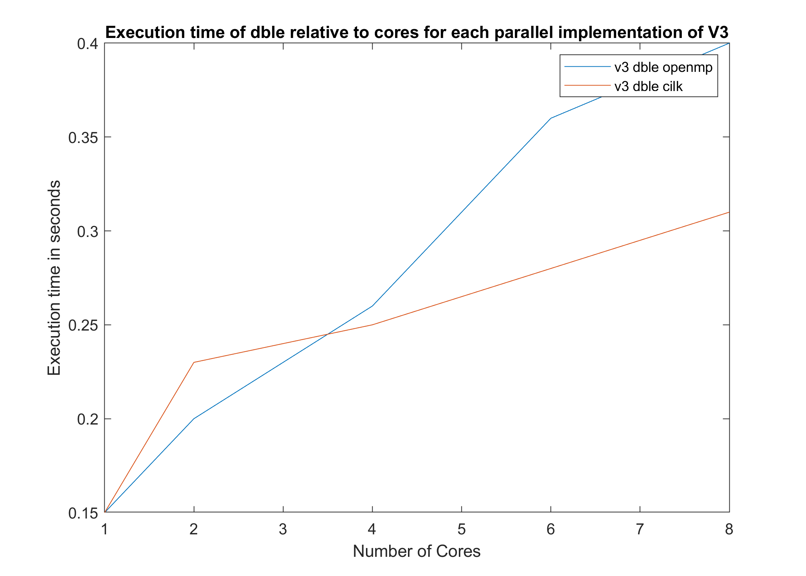
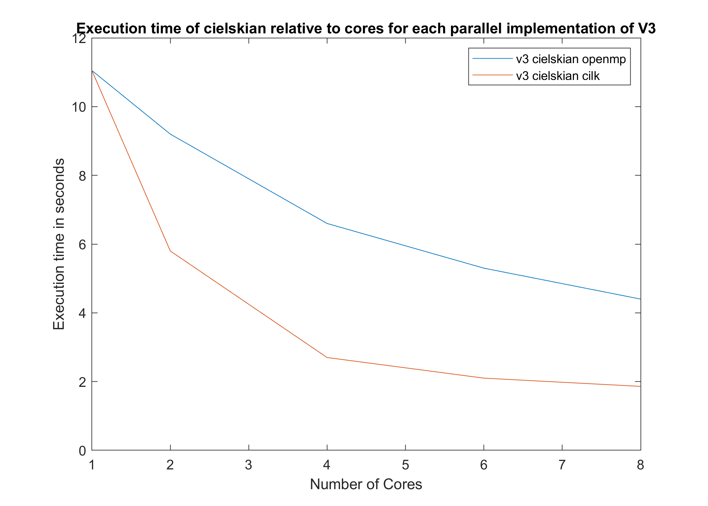

# Παράλληλα και Διανεμημένα Συστήματα 

Ο κώδικας για το v1 είναι το triangle.c

Ο κώδικας για το v2 είναι το triangle_v2.c

Οι κώδικες για το v3 είναι οι εξής:
- triangle_v3.c (σειριακά)
- triangle_v3_cilk.c (παραλληλισμός με cilk)
- triangle_v3_openmp.c (παραλληλισμός με openmp)

Οι κώδικες για το v4 είναι οι εξής:
- triangle_v4.c (σειριακά)
- triangle_v4_cilk.c (παραλληλισμός με cilk)
- triangle_v4_openmp.c (παραλληλισμός με openmp)

Στον φάκελο matrices βρίσκονται οι πίνακες σε μορφή COO

Στον φάκελο matlab βρίσκεται κώδικας για την υλοποίηση του v4 σε matlab.

Χρησιμοποιώντας την εντολή make all, μπορείτε να κάνετε compile τα απαραίτητα αρχεία σε c.

Για την εκτέλεση: 

`[executable name] [mtx file name] [1 or 0(1 for binary mtx, else 0) [number of cores in multicore codes]`

Παράδειγμα εκτέλεσης: 

`./triangle_v3 ./matrixes/belgium_osm/belgium_osm.mtx 1`

`./triangle_v3_cilk ./matrixes/belgium_osm/belgium_osm.mtx 1 2`

Εναλλακτικά μπορεί να χρησιμοποιηθεί το script `autorun.sh` το οποίο εκτελεί όλους τους κώδικες για όλους τους πίνακες με default αριθμό επεξεργαστών ίσο με 2.

---

## Αναφορά

# Παράλληλα και Διανεμημένα Συστήματα
# Μάριος Πάκας
# 9498

## Εργασία 1

### Ανάλυση της δομής δεδομένων
Το πρώτο βήμα στην ανάπτυξη κώδικα για τη συγκεκριμένη εργασία ήταν η ανάγνωση Market Matrix. Επειδή στην αρχή δεν έβρισκα δυαδικούς πίνακες, μέσω του command line terminal υπάρχει επιλογή να δώσει ο χρήστης την τιμή 0 για μη δυαδικό πίνακα και 1 για δυαδικό πίνακα (default 1). Έτσι γνωρίζει το πρόγραμμα αν ο coo πίνακας έχει 3 ή 2 στοιχεία ανά γραμμή και με αυτόν τον τρόπο μπορεί να τα διαβάσει δίχως πρόβλημα μνήμης. Ωστόσο δεν δουλεύει για πίνακες με μη μηδενικά στοιχεία στη διαγώνιο. 

Ακόμη, ήταν σημαντικό για το v3 να έχω τους πίνακες σε άνω τριγωνική μορφή, οπότε ήθελα να συγκρίνω την στήλη και τη γραμμή του συμμετρικού πίνακα ώστε, ανάλογα με το τι ήταν μεγαλύτερο, να το περάσω σωστά ως όρισμα στην συνάρτηση coo2csc και να βγει άνω τριγωνικός. Στο v4 με βόλεψε να δουλέψω με ολόκληρο τον πίνακα και όχι μόνο τον συμμετρικό, οπότε διπλασίαζα όλα τα στοιχεία.

Ανάλυση αλγορίθμου V3
Για το V3, εφόσον έχουμε πλέον τον πίνακα σε δομή csc η σκέψη μου ήταν η εξής: Ξεκινούσα από ένα τυχαίο στοιχείο έστω row1, col1. Τότε γνωρίζω ότι:
(row1,col1) -> (col1,col2) -> (col2,row1)
Στη μορφή csc ο εύκολος τρόπος αναζήτησης ήταν ανά στήλη να βρίσκω ποια γραμμή είναι μη μηδενική, επομένως είχα στα χέρια μου το πρώτο στοιχείο (row1, col1). Στη συνέχεια (και επειδή, λόγω συμμετρίας του πίνακα, ίσχυε ότι στήλη = γραμμή και το αντίθετο) μπορούσα να ψάξω για το στήλη row1 και να βρω ποιες τιμές υπήρχαν ως γραμμές. Συνεπώς είχα πλέον στα χέρια μου και το στοιχείο (col2,row1). Προκειμένου να υπάρχει λοιπόν τρίγωνο έπρεπε να αναζητήσω αν στη στήλη row1 υπήρχε στοιχείο στη γραμμή με συντεταγμένη col1!  Σε περίπτωση που υπήρχε αύξανα τον αριθμό τριγώνων και τον πίνακα c3 για τις αντίστοιχες κορυφές row1, col1, col2.

### Ανάλυση αλγορίθμου V4
Για τον αλγόριθμο στο V4 το πρώτο βήμα ήταν να υλοποιήσω τον πολλαπλασιασμό C=A⊙(AA). Στην αρχή έκανα ξεχωριστά τον κάθε πολλαπλασιασμό, αλλά στη συνέχεια το άλλαξα διότι ο A\*A έβγαινε πυκνός και ήταν πιο περίπλοκο στο χειρισμό της μνήμης. Η ιδέα πίσω από αυτόν τον πολλαπλασιασμό είναι ότι τα μόνα στοιχεία που θα υπάρχουν θα βρίσκονται στην ίδια ακριβώς θέση με τον αρχικό πίνακα Α. Επομένως ξεκινούσα περνώντας από κάθε στοιχείο (row, col). Στο επόμενο βήμα έπρεπε να υπολογίσω την τιμή (ΑΑ)[row,col]. Η τιμή αυτή ισούται με το άθροισμα των πολλαπλασιασμών ανάμεσα στις τιμές της γραμμής row και της στήλης col. Εκμεταλλευόμενοι την ιδιότητα της συμμετρίας όμως: γραμμή = στήλη. Επομένως κρατούσα σε έναν πίνακα k όλες τις συντεταγμένες  των στηλών που υπήρχαν στην γραμμή row και σε έναν πίνακα l όλες τις συντεταγμένες των γραμμών στη στήλη col. Οι πίνακες αυτοί, λόγω της δομής csc ήταν και ταξινομημένοι, επομένως με ένα από merge sort σύγκρινα μεταξύ τους τις τιμές και εφόσον υπήρχε στήλη ίση με γραμμή σήμαινε ότι το (AA)[row,col] έπρεπε να αυξηθεί κατά 1 (αφού Α δυαδικός). Με αυτόν τον τρόπο έβρισκα τις τιμές του C, μιας και ισούταν με τις τιμές του (ΑΑ), απλώς μόνο για τις συντεταγμένες που ο Α είχε ήδη στοιχεία.
Το επόμενο βήμα ήταν να υλοποιήσω c3=C\*e όπου e ένα διάνυσμα μοναδιαίο. Υλοποιήθηκε με τη λογική ότι το i στοιχείο στο τελικό διάνυσμα είναι το άθροισμα της i-στης γραμμής (Hint: στήλης) με όλο το διάνυσμα c3. Ουσιαστικά το i-οστο στοιχείο του c3 ισούται με το άθροισμα όλων των στοιχείων που έχει ο C στην ι-στη γραμμή!

## Cilk/Openmp
### V3

Χρησιμοποίησα το cilk_for/#pragma omp parallel for για να παραλληλοποιήσω το εξωτερικό for loop και να δουλέψω για κάθε στήλη παράλληλα.
### V4

Χρησιμοποίησα το cilk_for for για να παραλληλοποιήσω και το εξωτερικό for loop αλλά και το εσωτερικό, επομένως να δουλέψω με κάθε στοιχείο ξεχωριστά. Τη μεγαλύτερη διαφορά την έκανε η παραλληλοποιήση μόνο του πρώτου for loop, ωστόσο σε μερικά datasets (τα οποία ήταν πολύ μεγάλα) παρατήρησα μικρή βελτίωση, οπότε το κράτησα και εκεί.
Παρατήρησα ακόμη ότι ο παραλληλισμός του matrix*vector κομματιού, δεν είχε σημαντική διαφορά ή είχε χειρότερη επίδοση, για αυτό και δεν τον εφήρμοσα κι εκεί.
Για το Openmp χρησιμοποίησα το #pragma omp parallel  μόνο στο εξωτερικό loop, σε αντίθεση με την cilk υλοποίηση διότι δεν παρατήρησα βελτίωση με τον παραλληλισμό του εσωτερικού loop, αλλά χειρότερη επίδοση.
Pthreads

Η ιδέα πίσω από την υλοποίηση μου στο pthreads είναι η εξής. Σκέφτηκα να παραλληλίσω το for loop και να το σπάσω σε κομμάτια ανάλογα με τον αριθμό των πυρήνων (στήλες/cores). Με αυτόν τον τρόπο καλούσα παράλληλα μια συνάρτηση πολλαπλασιασμού για κάθε ένα μικρότερο υποσύνολο της στήλης, αφού ο υπολογισμός της τιμής του C ήταν ανεξάρτητη διαδικασία, συνεπώς έδινα σε κάθε επεξεργαστή το δικό του κομμάτι να δουλέψει. Η λογική αυτή παρουσιάζει περιέργως για κλήση με έναν πυρήνα χειρότερη επίδοση από το κανονικό v4, πράγμα που με παραξένεψε. Σίγουρα υπάρχει βελτίωση όσο αυξάνεται ο αριθμός των πυρήνων, σε σχέση με την κλήση για έναν επεξεργαστή, ωστόσο για μερικά datasets ακόμα και με 8 πυρήνες, δεν καταφέρνει να ξεπεράσει την σειριακή επίδοση της v4, πράγμα απογοητευτικό. Συγκεκριμένα για το cielskian έκανε εμφανώς περισσότερη ώρα, για τα Belgium, dble, περίπου τα ίδια με το σειριακό, ωστόσο για το NACA παρουσίασε σημαντική βελτίωση. Δυστυχώς για το youtube δεν μπόρεσα ποτέ να βρω το bug που το έκανε να μην τερματίζει, επομένως δεν έχω μετρήσεις για αυτό. Τέλος αξίζει να σημειωθεί ότι δεν κατάφερα ποτέ να το κάνω να δουλέψει καλύτερα απ’ότι η cilk.

### Μερικά Σχόλια

Παρατήρησα ότι ο αλγόριθμος v3 ήταν πιο γρήγορος σε όλα τα datasets πέρα από τον cielskian, στο οποίο υπερτερούσε κατά πολύ ο v4, μιας και στο cielskian δεν υπήρχαν καθόλου τρίγωνα.
Σε μερικές παράλληλες υλοποιήσεις υπήρχε βελτίωση όσο αυξανόταν ο αριθμών των πυρήνων (προφανώς όχι γραμμική), ωστόσο από κάποιο σημείο και μετά μπορεί να υπήρχε και χειρότερη επίδοση με την αύξηση των πυρήνων.
Ανάλογα το database κάποια υλοποίηση (ανάμεσα σε v3 και v4) παρουσίαζε βελτίωση με την παραλληλοποίηση, ενώ η άλλη χειρότερους χρόνους εκτέλεσης.

## Διαγράμματα που απεικονίζουν τους χρόνους εκτέλεσης κάθε προγράμματος

### V3

| | belgium | youtube | dble  | cielskian | NACA |
|:---:|:---:|:---:|:---:|:---:|:---:|
| v3 | 0.014 | 4.13| 0.15 | 11.05 | 0.21 |
|---|---|---|---|---|---|
|v3_openmp (2)| 0.021  | 2.31 | 0.20 | 9.2 | 0.30 |
|v3_openmp (4)| 0.011 | 1.75 | 0.26 | 6.6 | 0.34 |
|v3_openmp (6)| 0.008 | 1.51 | 0.36 | 5.3 | 0.43 |
|v3_openmp (8)| 0.056 | 1.36 | 0.4 | 4.4 | 0.50 |
|---|---|---|---|---|---|
|v3_cilk (2)| 0.0185  | 2.01 | 0.23 | 5.8 | 0.41 |
|v3_cilk (4)| 0.021 | 1.02 | 0.25 | 2.7 | 0.35 |
|v3_cilk (6)| 0.024 | 0.82 | 0.28 | 2.1 | 0.38 |
|v3_cilk (8)| 0.024 | 0.83 | 0.31 | 1.86 | 0.55 |

### V4

| | belgium | youtube | dble  | cielskian | NACA |
|:---:|:---:|:---:|:---:|:---:|:---:|
| v4 | 0.28 | 11.19 | 0.38 | 2.72 | 1.428 |
|---|---|---|---|---|---|
|v4_openmp (2)| 0.45 | 9.60 | 0.33 | 1.8 | 1.16 |
|v4_openmp (4)| 0.30 | 7.7 | 0.22 | 1.18 | 0.67 |
|v4_openmp (6)| 0.27 | 7.5 | 0.20 | 1.04 | 0.56 |
|v4_openmp (8)| 0.23 | 7.09 | 0.17 | 0.88 | 0.53 |
|---|---|---|---|---|---|
|v4_pthreads (1) | 0.60| - | 0.65 | 7.30 | 2.30 |
|v4_pthreads (2) | 0.32 | - | 0.40 | 5.30 | 0.96 |
|v4_pthreads (4) | 0.28 | - | 0.33 | 5.34 | 0.61 |
|v4_pthreads (6) | 0.28 | - | 0.35 | 5.29 | 0.69 |
|v4_pthreads (8) | 0.25 | - | 0.36 | 5.41 | 0.64 |
|---|---|---|---|---|---|
|v4_cilk (2)| 0.36  | 3.80 | 0.26 | 0.96 | 0.90 |
|v4_cilk (4)| 0.26 | 2.10 | 0.19 | 0.57 | 0.60 |
|v4_cilk (6)| 0.21 | 1.46 | 0.15 | 0.40 | 0.44 |
|v4_cilk (8)| 0.20 | 1.19 | 0.13 | 0.33| 0.39 |

